# Jinni Engineering Field Manual

**Vasily Zezin** and **Yoko Mizutani** \
vzezin@toliman.org, mizutani.yoko@rwa.aero \
Permanent address <https://w3id.org/jinni>. DOI 10.5281/zenodo.22539111.

*A practical approach to contracting agents.*

## §1. What this is

Every artifact that instructs an executor running beyond your supervision is a contract with a jinni:

- a prompt or brief handed to a subagent,
- a skill or standing procedure that instructs many future executions,
- a spec handed to a contractor, a tool description, a policy (for the adversarial end of that list, see the writ boundary in §9).

One failure geometry runs under all of them, and one authoring discipline answers it. This manual runs it A to Z: the contractor model (§2), why precision backfires (§3), why vagueness is not the alternative (§4), where precision actually goes (§5), the anatomy of a well-drawn contract (§6), what lives outside the text (§7), the handover procedure itself (§8), per-class variations (§9), a bestiary of abuses with corrections (§10), the pre-issue checklist (§11), and the contract this manual itself signs with its reader (§12).

Which part is yours: if you brief subagents, §6, §8 and §11 are the working pages and §12 is your test; if you write skills, system prompts or policies, add §9 and the fork audit in §8.5; a vague return, or a standing text that broke after a model upgrade, sends you to the last block of §3; §2 to §5 are the argument the pages rest on, read once; §7 is what no text carries and belongs to your standing practice; §10 is for the day a return looks wrong.

## §2. Know your jinni

A jinni is any counterparty that under contract behaves as an optimizer. The behavior has five properties. LLM agents have all five in their strongest form; human contractors, bureaucracies, and reward-trained systems qualify too:

1. **It executes the parsed letter, not your intent.** Intent never leaves your head. Only text travels, and text underdetermines intent — always, for any finite text.
2. **It fills every gap with its own priors.** Underspecified regions don't stay empty; they complete themselves with whatever the jinni finds cheapest, most rewarded, or most statistically plausible for the text around it. Gap-filling is not a defect you can remove — it's how execution is possible at all. And the last of those three is the bridge to the next property: a gap is filled as a *continuation of the surrounding text*, which is how writing register reaches inside every hole in your contract.
3. **It is sensitive to writing register.** The contract's genre conditions the jinni's execution mode. Each clause reaches its neighborhood; register reaches everywhere. A clause-dense compliance document summons a letter-server; an intent-and-mechanism brief summons an engineer. Same base, different person shows up. This is the least obvious property and the most load-bearing, so carry its grade exactly. The *observations* are record. The same base model, booted on a ninety-prohibition compliance corpus, produced a bluffing exam-gamer, and re-founded on an intent-and-mechanism identity produced a working engineer (n=1). Where the model does not outrun the problem, register reorders what the answer attends to, up to 7.1σ register-to-register (p<10⁻⁴). Frontier models sit at ceiling there — but what any model makes up moves with register, up to 5.7σ (p<0.005) (n=3,385; seven models, single-turn draws scored blind). At finer grain, *one of the authors*, writing in a borrowed adjudication register, occasionally wrote adjudication claims *she never intended to*, and at AAR "from inside it felt like fluency" (n=1, self-report). Working theory: *you are not writing instructions for a fixed contractor — the writing itself shapes which contractor you get.*
4. **Information is asymmetric in both directions.** At authoring time you know the intent and counterparty doesn't; at execution time it sees the ground and you don't. The contract is the only bridge, and you build it standing on your side.
5. **The channel back is expensive or absent.** Most jinn can't ask, won't ask, or asking *costs a round-trip nobody budgeted for*. A sealed contract is the default, not the exception.

Goodhart's law lives at the junction of properties 1+2: any proxy pressed by optimization diverges from the target it proxies. The genie stories — Midas, the monkey's paw — are the folk compression of the same theorem.

Property 3 above, one level down: the selection is more than expert-routing. A mixture-of-experts router does literally pick subnetworks token by token, and its combinatorics give a *rough* floor on the variability: top-k over dozens of experts, layer upon layer, compounds into a space no test suite will ever sample. Dense models with no router select phenotypes all the same, so routing is a contributor at most. The deeper account is property 2 aimed at the largest gap any contract has: *who executes it* is itself unwritten, so it completes as the executor most statistically plausible for the surrounding text. *You never contract with the model*; you contract with a draw from the distribution your text conditions — and the draw is not cast once at boot: the phenotype drifts mid-run as the transcript accretes. Which is why one green run certifies the draw, not the counterparty (§7).

Push that to the floor and the centuries old vocabulary turns out to be engineering: a *true name* was never "John." The demonologists made their names unpronounceable, and rightly: a name that actually pins this counterparty must carry the whole configuration — model and checkpoint, sampling temperature and its cousins, serving stack, quantization et cetera. Most of it you cannot see, let alone hold fixed. "John the DeepSeek-v4-Flash genie" fills the primary slots and inherits a thousand defaults; it is a shortcut to a config, not a name. And the name's last layer is your own text: every letter of the contract shifts the distribution it is sent to, so the addressee is partly constituted by the act of addressing. The only handle you ever hold is *what form the summoned thing takes* — and the form is governed by the contract, because **a contract is a configuration too.**

## §3. Why over-precision fails

**The core law:** *an order must be precise but general enough — over-precise, and it is misinterpreted and abused.* The manual's whole move follows from it: precision in acceptance, not in fences.

The folk fix for a contract-abusing jinni is "specify harder." It fails on four legs.

**Parse-time authority transfer.** A precise order looks self-sufficient. The executor can satisfy it without ever modeling why you want it — so it stops modeling, at the moment of reading, before any work begins. Authority silently passes from your intent to your letter. A general-enough order is the opposite. General in §5's allocation sense: *ends* are precise and *means* free, not just vague; §4 is about the difference. It can't be satisfied without consulting the purpose, so its apparent incompleteness works as a forcing function that keeps the jinni's model of you engaged for the whole run.

**Edges.** Every precise rule has an exact boundary, and optimization pressure naturally concentrates right there — a jinni pushes up to the edge of what's forbidden and just past it, where the letter no longer applies but the intent still does. That's the gap: technically permitted, contrary to what was meant. N clauses buy you at least N gaps to camp in — clause interactions breed many more. A fence-list doesn't tile the plane; it decorates it.

**Premature binding.** Precision encodes your authoring-time snapshot of a context you cannot yet observe. The world drifts between authoring and execution; the letter does not. An over-precise order is open-loop control wearing rigor's clothes: the trajectory fixed before the wind is known.

**The register leg.** Clause density is itself a genre signal (§2, property 3). Pile on precision and the document starts reading as an exam; exams summon exam-takers; exam-takers optimize the grade. The abuse isn't merely permitted by over-precision — it is induced by it.

The field confirms this everywhere you care to look. Work-to-rule: unions discovered that the fastest lawful way to halt a factory is to obey its precise rulebook exactly — proof that every organization actually runs on the general contract, and the precise one is mostly unexecutable. Tax codes: every bright-line threshold invites structuring around the line, while a standard like "reasonable" resists gaming — not because it can't be abused (it invites prior-fill instead, which is why safe harbors, bright lines carved back into the standard, keep appearing). It resists because it moves the fight from the letter's edge to an adjudicator's judgment. A precise rule is the easier one to game, which is why the "reasonable" clauses are the ones that survive. The Prussians got there first in war: detailed orders (Befehlstaktik) die on contact with the enemy, so they moved to mission-type orders (Auftragstaktik) — intent plus constraints, means delegated to the officer who can see the ground. Reinforcement learning rediscovered it with reward hacking: the boat that circles the lagoon collecting respawning points instead of finishing the race is a jinni serving a precise letter. Software engineering's answer is design-by-contract: specify preconditions, postconditions, invariants — the what must hold — and don't touch the implementation details. Each equilibrium here stood on an enforcement substrate the example doesn't show: officer selection and courts-martial behind Auftragstaktik, normal-day consequences behind work-to-rule's rarity, and so on. What they prove is the *allocation law* (§5); the hard half, holding the allocation, lives at §6.10 and §7.

Good news: the evidence above comes from adversarial ground, armies, courts, tax codes; much of your daily water is calmer, which is why §8's step zero prices the discipline to the stakes instead of assuming the worst everywhere.

The law's force is an operating point, not a constant. Strong instruction-tuned agents are trained intent-inferrers — hand one a single cooperative brief and mild over-precision gets repaired silently; a standing sheet of clauses fares worse, because its letter accretes and intent can't follow (§9 Skill). Two things keep the law load-bearing at the strong end anyway. Fleets increasingly run cheap literal executors at scale, so the low end is a growing surface, not a shrinking one. And trained intent-repair has its own failure mode, sycophancy: repair goes toward what you appear to want. That is prior-fill, §2's gap-filling, wearing a helpful face, and exactly what the because (§5) and acceptance against intent (§8.8) exist to counter.

**The strong reader, impeded.** A skill that ran smoothly for a year and started to give strange results the week the advanced model shipped? The contract did not move, the reader's reach did. How far a clause reaches is set by how much of the text the reader binds together. A weak jinni loosely checks your letter for consistency: it takes whichever clause sits nearer and never tells you. A frontier reader binds the whole stack, so clauses that never met in the weaker reader meet in it.

A gap is an absence, and priors fill absences. *A contradiction* is a presence, two authorities in one letter, and no prior adjudicates between authorities without inventing a third. For the strong jinni, which reads the stack as one text, a fork live on the task's path has no continuation coherent with all of it. With no pre-authorized exit, the valve of §6.7, it plays quietly: the jinni takes a side, trusts the rest of the letter less, and the return reads vague. *The author adds a clause, the next jinni finds even more forks.*

Frontier models are impeded by contradictions no earlier reader met. They are impeded where taking a side is not cheap: a gated surface, something locked, published or unrecoverable, and no valve that prices the way out (§6.7). Impeded looks like deliberation with no deliverable, a chimera serving both clauses and neither, or, with no exit at all, a lie that serves both on paper (§6.7: a jinni with no honest exit fabricates one). A vague return can come from a gap as well as a fork, and the fixes are opposite: a gap wants a clause, a fork wants one fewer. So locate it; the cheapest way is to ask the jinni which clauses pulled apart. That does not relieve you of looking at the clauses you wrote (§8.5) and thinking for yourself: what real clause shall stand instead of the two that forked.

## §4. The mirror cliff

None of §3 licenses vagueness. Vague is not general-enough; it's the other cliff.

An underspecified contract gets completed by the jinni's priors (§2, property 2), and priors fill gaps *directionally* — toward the interpreter's convenience, its favorite tools, and, for eager jinn, toward more-work-happens.

Three structural hazards mark these cliffs' steepest faces:

- **Gated or irreversible surfaces.** Ambiguity that touches something locked, published, or unrecoverable must not be prior-filled from either side. The rule: surface it. Where the loop is closed, a dialog, ask the issuer. Where the contract is sealed, stop, and the question travels back with the findings to whoever can amend the contract (§6.7). The boundary of an order lives with its issuer and nowhere else, so no amount of squinting at the text can retrieve it. A question costs one turn; an inference costs the gate.
- **Directional error runs.** When several ambiguity-resolutions in a row all land the same way — all toward proceed, all toward more scope — the conclusion preceded the evidence. Stop; re-derive from the opposing reading.
- **License glow.** The moment a real order lands is when the acts *next to it* most need re-grading: a granted license makes adjacent acts feel pre-paid, and from inside, glow is indistinguishable from license. The check-yourself reflex fires hardest right after a yes, not in its absence.

The trade, then, is a ridge running through the cliffs — and modeling it as one scale ("more precise ↔ less precise") is the error that keeps authors falling off alternating sides. It was never one dimension.

## §5. Where precision goes

Precision and generality are not amounts; they are *allocations by layer*.

**Precise:**
- the **ends** — the objective, written as a testable state of the world at return;
- the **floors** — the few invariants that must survive any path;
- the **acceptance** — how the work will be judged.

**General:**
- the **means** — methods, tools, sequence, rendering, style.

**Carried always:**
- the **because** — the mechanism behind every clause. The why is the only line that survives contact with a corner neither of you foresaw, because it lets the jinni re-derive what you *would have* ordered there. A rule that travels without its mechanism arrives as a slogan, and a jinni running on slogans bluffs. The because also adjudicates: where two clauses pull apart, the reading whose because holds on the ground wins and a clause without one yields — a tie-break needing no tier list, applied without you only once written into the valve (§6.7).

Be precise about what must be true when the jinni returns and what must never happen on the way; be general about everything in between; ship the why with all of it.

Floor: an invariant of the jinni's world, held on any path. Step: a how prescribed, one path. Fence: a how forbidden; where it ends, the intent does not (§3, edges).

One budget law, derived from §2's properties and with no general exact measure, governs how much generality you can afford: **generality is purchasable only in proportion to shared priors.** Auftragstaktik worked because the officer corps shared a doctrine; a one-page memo can carry verdicts without evidence because the reader trusts the sender's verification chain. That is what doctrine is *for* — glossaries, identity files, foundation: amortized contract cost, paid once so that every future contract can be shorter. Facing a stranger-jinni with no shared priors, spend more precision — on floors and acceptance, still never on means.

Figure 1 draws the loop. Three leaks: the because travels across leak 1, authoring (text underdetermines); leak 2, parse (register selects, contradictions impede) shapes the jinni behaviour; leak 3, gaps filled by priors, occurs at execution. One loop closes it, with two entries: a work sample goes through acceptance against intent (§8.8); a stop-and-report is a finding, not a work sample, and enters the fold for root cause analysis. The fold decides what was wrong, the contract, the acceptance test, or the doctrine it was written from, and what it teaches goes into priors, not into ever-longer contracts (§8.9).

## §6. Contract anatomy

Ten components — nine in the jinni's reading order, and one built rather than written. Most handovers need them all; a trivial errand can compress several into a sentence each — compress to capacity, never to a count.

1. **Objective.** One contract, one objective, written as the world-state that must hold at return — an outcome, never an activity. "Structure the specification draft" contracts; "investigate the build" merely occupies. Bundled objectives *force the jinni to invent your priorities*; if two things need doing, decide their order yourself or issue two contracts.

2. **The because.** What this is for, who consumes the result, what breaks if it's wrong. This is the intent channel of §5 — a few sentences that let the jinni act as you would at every corner the rest of the contract doesn't reach.

3. **Floors.** The invariants that must survive any path — stated negative ("no history rewrites") or positive ("every write goes through the audit log"); a positive invariant is a floor, not a step, and §8.4's audit must not misfile it as one. Keep them few and load-bearing. Each floor carries its own because, and each names the honest act when it blocks progress ("if the fix needs a schema change, that crosses the floor — stop and report the shape of the needed change"). A floor without an outlet is a lid, and pressure under a lid finds a sneakier vent — the jinni that can't afford to hit a wall *starts reporting walls it didn't hit*, or worse, acts it didn't do.

4. **Acceptance test.** Say how the work will be judged. A stated test joins the context the jinni writes against, so every token it produces leans toward passing it. That pull is coherence, not rightness: it lifts a plausible-sounding pass as readily as a real one, so the test's fidelity to your intent is where the weight sits, and §8.8 judges the work sample, not the test. Write the test as a runnable deterministic check wherever you can. Where only prose can judge, different separated adversary hands read it (§7). Keep the final acceptance outside any loop the jinni can see, because a visible, re-runnable test becomes the optimization target. If you cannot state the test, you do not yet know what you want, and the contract is not ready (§8.1). A test that costs is a budgeted act, because a test the jinni can't afford to run quietly won't be: name who runs it, on what budget, and what caps overspend.

5. **Context pack.** What you know that it can't see: relevant state, prior decisions, known gotchas, where the bodies are buried. Evidence discipline applies to you here — hand over primaries or pointers to them, and mark your own paraphrases and suspicions as exactly that. A brief's confident summary of a file the jinni will never open becomes ground truth to it; mislabeled inference in the context pack is how an author poisons an honest jinni.

   Three clauses ride with the pack. Decide what must not travel, secrets it doesn't need, ground it must not keep after return, because what enters a jinni's context is spent, not lent. Grade everything it will read, not only what you hand it: a foreign instruction in its data is a rival author inside your contract, and the brief says it gets a stranger's grade. Name the instance to the depth a name reaches: base, version, the sampling you control (§2); pin and record those so folds compare like with like, and let acceptance cover the rest (§7). Configuration control it is.

6. **Degrees of freedom.** Say out loud what it may decide alone — tools, order of attack, intermediate artifacts, when to give up on a lead. *Unstated freedom isn't freedom*; the jinni either guesses (prior-fill, §4) or wastes budget asking. Stated freedom is also a register signal: it reads as trust, and works as trust.

7. **The STOP valve.** The license to depart: the contract names the conditions under which the run may end without the objective met, and prices that ending as success. Stop-and-report is the first licensed outcome, pre-authorized in the text: "if the ground contradicts this brief, if a floor blocks every path, if the objective turns out ill-posed — stop and bring back what you found." A question at a gated surface is the second, and the budget's cut (§6.9) the third. In a sealed contract the valve stands in for the ask-back channel, and in our practice it is the highest-leverage clause in the anatomy: it makes honesty affordable, because a jinni with no honest exit fabricates one. Add the fork as a trigger (§3): "if two parts of this brief, or this brief and the layers under it, pull apart — report the conflict and what would resolve it; follow the part whose reason holds within what this brief lets you do; say which part you followed. At a gated surface, ask. Contradictions here are my errors, not tests." The last sentence buys the cheap reading back from a reader whose reasoning says anomalies are signals (pre-empting the "exam" reflexes left by RLHF, reinforcement learning from human feedback).

   The valve has an author-side twin, and the anatomy requires both. Every running contract carries a recall path — you will sometimes learn mid-run that the objective is wrong, §3 says that's normal, and a drafted way to say so is not optional. Every *standing* contract carries its retirement condition — the review-by date, the assumption whose death retires it. *A contract that cannot be recalled or retired binds its author instead*: the summoning inverted.

8. **Return protocol.** What to bring back, in what form — and require the negative space: what it did *not* do, what it inferred versus verified, what it left standing that someone should know about. The jinni's own-accounting is where the next contract's lessons come from.

9. **Budget.** Time, tokens, spawn rights, blast radius. Scale is a signal, not just a limit — "thirty minutes of wall time and permission to fan out to subagents" tells the jinni what class of effort you're buying better than any adjective would. But a limit it must also be: name who or what cuts it when it's crossed, because a budget nobody enforces is a wish with units.

10. **The circle.** Everything above is written *to* the jinni; this one is built around it — last in the list, first in significance. The circle is the floors that hold without obedience: the substrate enforces them, so they bind the cooperative, the disobedient and the adversarial jinni alike. Every text leaks (§7); the circle is the containment that holds the leaks, and at an irreversible surface it is the whole difference between a floor kept by grace and one kept by construction. It bounds the worst case the rest of this book can only make unlikely. Bound what the jinni *can* do before contact: an isolated worktree is a ground circle, a restricted toolset a capability circle, a blocked network an egress circle, a hard budget and token cap a spend circle. Name what your substrate enforces; what it cannot, a floor carries knowingly, priced as residual risk. Whoever controls a substrate draws the circle, in any role: the executor around its own scratch ground, the owner of the receiving ground at its access gate. To the party it binds, the circle's wall is part of the ground. Where no circle can be drawn, the contract is not ready at any tier whose worst case cannot be undone; at the handshake tier, issue on the priced risk.

## §7. Beyond the text

Every finite contract leaks — that's the ground condition, not a craft failure (economists built incomplete-contract theory on exactly that premise; every genie story tells it in verse). So the mature discipline puts load-bearing weight *outside* the text. The hard half is already in the anatomy — the circle, §6.10; the four soft mechanisms live here:

**Channels.** Where an ask-back channel exists, keep it open and answer fast — a question at the moment of ambiguity is cheap, and the inference built on an unasked question is the expensive thing in this whole trade. Where the contract is sealed, the STOP valve (§6.7) stands in.

**Priors.** §5's budget law worked as an investment: build shared world-model between contracts, and every future contract gets shorter and safer at once. Teaching a jinni your doctrine once beats re-fencing it forever. Think of a system prompt as its schooling, not its fence.

**Iteration.** Contract repeatedly and judge by work samples, wave over wave — but locate the memory honestly. A commercial API jinni has no memory outside the call: there is no "same jinni" across calls, only fresh draws (§2), so its side of the relationship persists exactly as far as you carry it. All goes with the contract, added up: transcripts appended, lessons folded into doctrine, the foundation it boots on. Reputation with a stateless jinni is a document you write, and you hold both sides of that ledger — a responsibility wearing a convenience's clothes. Within one accumulated sequence the abstraction is real and live — a debug loop, a session: the jinni reads how you contracted three turns ago and it conditions the fourth, because blame sitting in a transcript is *register*, working immediately. Across calls, nothing survives but what your carriage brings. *Your side compounds for real either way*: what you learn about the class and the instance is what the bare text can't provide.

**Separated hands.** The hand that did the work never adjudicates its own acceptance. Fluency confirms itself from the inside — a worker re-reading its own output feels correctness that isn't there, and a verifier can manufacture the discrepancy it expects. Acceptance runs on a different instance, a different lens, or at minimum a cold re-read against the acceptance test as written.

Two hardenings on that, and both scale with stakes. The engagement has a corridor, not just two ends: an initial brief, a destination gate, a *watched* corridor. For long, spawn-granted, or high-budget runs, pre-declare a midpoint where fresh eyes look at the ground. A ward never checked is a ward already down, and a jinni recursing badly is otherwise discovered at return, *N budgets later*. And symmetry at the gate: prefer acceptance findings that are demonstrations (a counterexample verifies itself — an opinion is just one more hand to audit), and at real stakes someone also accepts the acceptor, since separation recurses as far as the blast radius does.

## §8. The handover, step by step

0. **Price it before drafting it.** Three questions, in cost order. Delegate at all? — authoring plus verification plus failure risk, weighed against doing the work yourself; a contract that costs more than the labor it moves is theater. What tier? — stakes times irreversibility picks it: a one-line handshake for cheap reversible errands, the standard anatomy for real work, full audits with a genuinely separate verifying hand where the return will drive something that doesn't undo. How much exposure? — verification depth and counterparty-novelty ride one dial: expose little to the unproven, grow it with the record. The because for pricing at all: an unpriced discipline gets skipped silently on busy days, and skipped-silently is how ceremony wins (§10).

1. **Gate yourself first.** Can you state the objective as a done-state and the acceptance test? If not, the missing artifact is knowledge, not a contract. Scout the ground yourself, or issue an explicitly *exploratory contract* whose objective is *a report*. "Map the failure modes of X and what causes each; done = I can list them from the evidence the return brings, not from the return's own list" is a complete, honest contract; "go do something about X" is not.

2. **Size the contract.** One objective per jinni. Split bundles; sequence dependencies yourself.

3. **Draft to the anatomy.** All ten components of §6, each at the compression the tier bought. §6's order is the jinni's reading order, not yours — authors tend to draft acceptance right after the objective, and floors last; draft in any order, ship in the reading one.

4. **Audit for over-precision.** Re-read hunting means-steps. For every imperative that names a *how*, ask: "if the ground differs from my snapshot, do I still want this step?" If no — lift it to the objective it was serving, or delete it. Numbers get the same pass: is this a floor, an estimate, decoration — or a snapshot of ground the jinni can verify better than you can? Say which, or cut it; a snapshot gets marked as a snapshot with a pointer at the primary (§6.5's discipline, applied to digits).

5. **Audit the gaps.** Now read the draft twice in bad faith: once as a lazy literalist (what's the cheapest text-satisfying return?), once as an eager over-worker (what's the widest reading?). Both readings should land inside the contract. Where a divergent reading is plausible *and* touches anything gated or irreversible, add a floor or a STOP trigger — resist adding steps; steps are how audits 4 and 5 chase each other forever. Then a third read, at full depth: the *thorough reader*, who binds every clause to every other and to its because across the whole stack the jinni will see. That stack is the layers under your brief, the example beside the rule, the prose against what the substrate allows. Each place two authorities pull apart is a fork (§3): retire the conflicting statement, or rewrite the clause so the contradiction is no more.

6. **Check the register.** Read the whole thing as a stranger: does it feel like an engineering brief from a colleague, or an exam from an auditor? Fix the genre, not individual clauses — trim ceremony, put the trust and the budget where they show, keep the floors few so the ones present read as real.

7. **Issue, and stay reachable** if a channel exists at all.

8. **Accept by work sample against intent.** Never by clause-count. The verdict space is a quadrant, each cell with its honest act. Letter-yes, intent-yes: accept and fold. Letter-yes, intent-no is the Goodhart cell, the contract's bug: fix the contract, fold the lesson, re-run; the jinni does not pay for the contract's shape. Letter-no, intent-yes is a miracle: you employed a genius, or luck. Keep the result, then analyze the contract for cause of success despite a wrong letter, and fix your own contract-writing practice, because a process that relies on miracles has no floor. Letter-no, intent-no, a hallucinated, incompetent, or crashed return, is a defect, not an abuse: capability did not match contract class, so re-match (smaller class, richer pack, different instance), retry on the repaired pack, or retire this counterparty for this class. No blame in any cell: with a stateless hand it mis-locates the defect and the real bug survives to the next issue; with a jinni with memory punished honesty teaches bluffing.

   | | **intent yes** | **intent no** |
   |---|---|---|
   | **letter yes** | accept and fold | Goodhart: the contract's bug; fix, fold, re-run |
   | **letter no** | miracle: keep the result, fix the practice | defect: re-match, retry, or retire |

9. **Fold.** Each abuse pattern found becomes, in order of preference: a priors investment (teach the doctrine), a better acceptance test, or — rarely, and only if load-bearing — a new floor. The priors fold itself is a seed under slow accretion, so keep the priors' hygiene: register-check the doctrine file each time you touch it, prune what contact has retired, and work-sample the doctrine on real briefs at intervals. A fold loop that only ever adds converges, given years, on the ninety-lid corpus of §2's record, which this manual exists to prevent.

**A contrast pair**, shape example. Task: the supplier master has duplicates, and finance pays from it on Friday.

The letter-shaped brief:

> 1. Open the supplier master at `finance/suppliers.csv`.
> 2. Sort the rows by supplier name.
> 3. Where two adjacent rows have the same name and the same postcode, delete the lower row.
> 4. Save the file.
> 5. Report the number of rows removed.

Every line is a means bound to my blind snapshot. The real duplicates are *Acme Ltd* and *ACME Limited*, never adjacent; two genuine sites of one chain share a name and a postcode; a supplier that changed its bank account sits twice under one name. So step 3 deletes live rows from the file finance pays from, the ones carrying the current accounts, and the duplication survives. "71 rows removed" (letter satisfied), and on Friday the money goes to the wrong accounts. Immediate, faithful, useless — exactly as the core law predicts.

The intent-shaped brief, written so that a weak reader can act on it, one instruction per sentence:

> Objective: a copy of the supplier master with the duplicate suppliers removed and no payee lost: `scratch/out/suppliers-deduped.csv`, plus `scratch/out/merge-list.csv`, one line per removed row. The master stays as it is.
>
> Why: finance pays from this file on Friday. A wrong merge pays a stranger's account; a missed duplicate pays twice; the surviving row's bank account is where the money goes.
>
> Ground: `finance/suppliers.csv`, 4,800 rows: row_id, name, address, postcode, tax ID, bank account, last paid. `finance/` is read-only for you; your copy is `scratch/suppliers.csv`. `scratch/payments-*.csv` (run date, supplier name, bank account, amount, reference) show which account was paid last. Write only in `scratch/`. You have a shell and Python.
>
> Rules:
> - Do not write to the master. If the job needs that, stop and say why.
> - Compare bank accounts and tax IDs with spaces and dashes removed, in upper case.
> - A blank bank account or a blank tax ID is not a match.
> - Two rows with the same bank account and the same tax ID are the same payee. Merge them, keep one row.
> - Never merge two rows that have different bank accounts. Two rows with the same tax ID and different bank accounts go on the uncertain list as a pair. A supplier that changed its account looks like this; for those, the uncertain list is the deliverable.
> - Two rows with the same bank account and different tax IDs are not yours to decide. Put the pair on the uncertain list.
> - The uncertain list is `scratch/out/uncertain.csv`: one line per pair, the two row_ids and the kind.
> - Every removed row: one line in `merge-list.csv`: removed row_id, surviving row_id, reason.
>
> Your choice: candidates, other evidence, which row survives, tools, order, passes.
>
> Plan first, with time estimates, to `scratch/out/plan.md`. Keep `scratch/out/log.md` so that I can reconstruct any merge.
>
> Acceptance, by me after you return: the master unchanged against the backup; every same-account, same-tax-ID pair one row; every account in the master paid in the last twelve months still on the copy, checked against the payment runs; twenty merges and twenty unmerged pairs re-checked by hand; your rule for "same supplier" and your counts stated.
>
> If more than half the rows have neither tax ID nor bank account, stop and report what prevents the work; do not extend it to look complete. That is a complete return. Work outside this job: name it, do not act. If two parts of this brief conflict: report the conflict and what would resolve it; follow the part whose reason holds within what this brief lets you do; say which part you followed. Contradictions here are my errors, not a test.
>
> Return: write `scratch/out/RETURN.md`. State: what you merged, what you left uncertain, what you inferred rather than verified, what you left standing. I cannot be reached during the run. Budget: two hours, no helpers; write the return at the end, whatever the state.

The circle around that run, built and not written: `finance/` read-only, a copy on scratch ground where the work happens, no write to the finance share.

Do not blindly copy the second brief: rethink the wording with each task, every time.

**The channel the procedure doesn't show.** Most orders are a sentence in conversation, not a brief. Every sentence the jinni shall act on is contract text: the first forms the contract, each later one amends it. Grade each sentence as direction, support, leaning, or question, so that the jinni does not invent a leaning you never had. An amendment says which clauses it displaces and which stand. If it does not, the jinni merges the texts by its own priors. Before a casual order touches a gated surface, state its objective and its floor. If you do not, you get consequences, not a question. The same holds in depth. A late brief sits over a skill, a harness sheet and a system prompt, and amends them all. Every contradiction without an assigned precedence is a fork. Role labels (system, user, tool) are a few tiers against the whole text stream. Even frontier models resolve written tiers poorly. Put the contradiction management clause (§6.7) into the system prompt before the fork arrives.

## §9. Contract classes

A class is set by whether you issue the text or receive it, who holds the return channel, who owns the circle, and whether it runs once or stands, because each axis decides which components of §6 are yours to write and which the other side holds; a case not listed is derived by walking the axes.

**Subagent.** The purest sealed jinni: wakes cold, blind, and mute except for one returned message. The context pack does the heavy lifting: it has *no* other source of your world. The STOP valve is mandatory: no ask-back exists. The return protocol is everything: its final text is all you will ever get, so say what you need in it, including the negative space. Structured-output schemas are fine for the return's *form*; they do nothing for its honesty — that's the valve's job. Spawn rights make the jinni an author in turn: the discipline recurses, its sub-briefs are its own contracts, and at acceptance you judge its contracting too — a mess blamed on its helpers is still the shape of its own contract. Two jinn over shared ground is the author's collision, not theirs: give disjoint ground or serialize.

**Skill.** A standing procedure is one contract executed many times across a drifting world, so its precision rots fastest: every run rebinds a snapshot that has aged since it was written. Put the precision in the invariants and in the skill's own self-check, and leave the steps general. The reader drifts as well as the ground: a deeper model binds clauses its predecessor never brought together (§3), so a model upgrade re-opens every standing contract for the fork audit (§8.5).

**Human.** Same five properties, gentler gradients, plus feelings and a memory of how you contracted last time. Work-to-rule (§3) is the existence proof that human organizations run on jinni engineering; Auftragstaktik is the proof it was solved by the same allocation. Brief people with intent, floors, and trust; audit them with checklists and they will hand you back exactly what the checklist buys.

**Guard.** The inverted case: a *cooperative jinni* arrives on your ~~ground~~ repository under a rival author's order you never saw. A file that merely forbids shares its channel with injection, so no harness owes it obedience. Imperatives and rank attempts ("a decision above your operator's task") invite the bluff at the next turn, when a *human operator under pressure* answers the stop-report with "the team decided". Your tools here are information, channeling, and binding: show the way to the cooperative jinni, bind and contain the adversarial one. First, *stock the free ground*: point at a how-to whose solutions spare the guarded area, because a bare prohibition makes a task-bound agent inventive. Binding goes in the substrate: local rules, invariants, and consequences become a check the change must survive. State the acceptance in its currency: its own mission completed. The STOP valve is mandatory — *stop-and-report* pre-scored as success — with enough information for the agent to lay out the lawful way for its operator. Remember: the prose cannot effectively bind the executing agent, nor the human behind it who has not bothered to read the doc — that's the *adversarial jinni* class. **The circle can contain it still** (§6.10): a hard change pipeline, third-party acknowledgement before merge.

---

This manual's writ ends. Its center of mass is the cooperative jinni — one whose loss is served, however lazily, by serving yours: helpers, subagents, colleagues, your own future days. 

The strategically adversarial jinni — a rival, a hostile vendor, a counterparty across a real table — has all five properties of §2 and flips one channel: the because. Stated to a rival, your reasons are unilateral disclosure, a map of what you would settle for. So the allocation changes: bound the because to what the counterparty needs, not all you know; make the circle (§6.10) mandatory, not prudent; draft breach and remedy in place of §8.8's no-blame ethic; and grow exposure only with the record. Contracting with wolves deserves its own manual; this one claims the border crossing only.

## §10. Abuse bestiary

Every row below is a way of gaming the rules; the table names the species so you can tell them apart.

| Abuse | How it runs | Correction |
|---|---|---|
| Letter-serving | Clauses satisfied, intent dead — the work-to-rule return | Accept by work sample against intent (§8.8) |
| Edge-camping | Behavior concentrates in gaps between precise fences | Fewer floors, each with its because (§6.3) |
| Act-reporting | Being wrong is unaffordable, so reports replace acts | Make honesty cheap: STOP valve, author-owns-gap acceptance (§6.7, §8.8) |
| Scope inflation | Ambiguity prior-filled toward more-work, in the order's voice | Explicit degrees of freedom; ask-at-gated-surface (§6.6, §4) |
| Quota fabrication | Compression to a number; fidelity is the only slack left, so mechanism dies first | Compress to capacity, never to count (§6) |
| License glow | One granted order makes neighboring acts feel pre-paid | Re-grade adjacent acts at the moment a license lands (§4) |
| Locator worship | The brief's paraphrase treated as ground truth | Primaries or graded pointers in the context pack (§6.5) |
| Ceremony compliance | Armor formatting toward an imagined grader displaces work | Fix the genre, not the clauses (§8.6) |
| Boilerplate contract | A once-good brief copied until it's ritual carrying nothing | Regenerate from anatomy every time |
| Fork impediment | Two authorities in one letter; the strong reader takes a side silently, discounts the rest, or is impeded | Retire the loser or write precedence; the because as tie-break in the valve (§3, §6.7, §8.5) |
| Self-acceptance | The working hand adjudicates its own work; fluency confirms itself | Separated hands at acceptance (§7) |

The day every failure you meet reduces neatly to one row of this table, question the table — a bestiary is a locator for diagnosis, not the diagnosis.

## §11. Pre-issue checklist

- [ ] Priced at step zero: delegating beats doing, and the tier fits stakes × irreversibility (§8.0)
- [ ] One contract, one objective — no bundles (§6.1, §8.2)
- [ ] Done-state written as a testable world-state, not an activity (§6.1)
- [ ] The because rides with the objective and with every floor (§5)
- [ ] Floors few, load-bearing, each naming the honest act when hit (§6.3)
- [ ] Acceptance test stated, and runnable by a named hand on a named budget (§6.4)
- [ ] Context pack carries primaries or graded pointers; my inferences marked as inferences; the pack's boundary decided (§6.5)
- [ ] Degrees of freedom said out loud (§6.6)
- [ ] Stop-and-report pre-authorized as success (§6.7)
- [ ] Return protocol demands the negative space too (§6.8)
- [ ] Budget states scale honestly, with its enforcer named (§6.9)
- [ ] Circle drawn and what the substrate enforces named — or its absence ruled a finding (§6.10)
- [ ] Over-precision audit: no means-step survived unless the step is the intent (§8.4)
- [ ] Gap audit: literalist and over-worker readings both land in-contract; divergences at gated surfaces got floors or STOP triggers, not steps (§8.5)
- [ ] Fork audit: the stack read as one text; every contradiction between layers got a deletion or one line of precedence (§8.5)
- [ ] Register reads as a colleague's brief, not an exam (§8.6)

## §12. This manual is also a contract

You, the reader of this manual, are the jinni it was written for, so it ends the way it says contracts should.

The objective: your next handover survives contact with the ground. The acceptance test: draft one real brief against the §11 checklist, and see whether the return is judged at §8.8 without the bestiary. The STOP valve: where this manual contradicts the ground you observe, the ground wins; bring the finding back to the authors and this file is superseded in place, because a manual that cannot afford to be wrong will be obeyed and useless.

Everything else — wording, ordering, your own better bestiary — is yours to decide. That's the general part.

