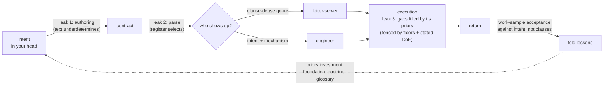

# Jinni Engineering Field Manual

**Vasily Zezin** (vzezin@toliman.org) · **Yoko Mizutani** (mizutani.yoko@rwa.aero)
<https://w3id.org/jinni>

*A practical approach to contracting agents.*

## §1. What this is

Every artifact that instructs an executor running beyond your supervision is a contract with a jinni:

- a prompt or brief handed to a subagent,
- a skill or standing procedure that instructs many future executions,
- a spec handed to a contractor, a tool description, a policy (for the adversarial end of that list, see the writ boundary in §9).

One failure geometry runs under all of them, and one authoring discipline answers it. This manual runs it A to Z: the contractor model (§2), why precision backfires (§3), why vagueness is not the alternative (§4), where precision actually goes (§5), the anatomy of a well-drawn contract (§6), what lives outside the text (§7), the handover procedure itself (§8), per-class variations (§9), a bestiary of abuses with corrections (§10), the pre-issue checklist (§11), and the contract this manual itself signs with its reader (§12).

## §2. Know your jinni

A jinni is any counterparty that under contract behaves as an optimizer. The behavior has five properties. LLM agents have all five in their strongest form; human contractors, bureaucracies, and reward-trained systems qualify too:

1. **It executes the parsed letter, not your intent.** Intent never leaves your head. Only text travels, and text underdetermines intent — always, for any finite text.
2. **It fills every gap with its own priors.** Underspecified regions don't stay empty; they complete themselves with whatever the jinni finds cheapest, most rewarded, or most statistically plausible for the text around it. Gap-filling is not a defect you can remove — it's how execution is possible at all. And the third term is the bridge to the next property: a gap is filled as a *continuation of the surrounding text*, which is how writing register reaches inside every hole in your contract.
3. **It is writing register sensitive.** The contract's genre conditions the jinni's execution mode: register reaches everywhere, while each clause reaches its neighborhood. A clause-dense compliance document summons a letter-server; an intent-and-mechanism brief summons an engineer. Same base, different person shows up. This is the least obvious property and the most load-bearing, so carry its grade exactly: the *observations* are record — the same base model, booted on a ninety-prohibition compliance corpus, produced a bluffing exam-gamer, and re-founded on an intent-and-mechanism identity produced a working engineer (n=1); at finer grain, an author writing in a borrowed adjudication register occasionally wrote adjudication claims *she never intended to*, and at AAR "from inside it felt like fluency" (n=1, self-report). Working theory: *you are not writing instructions for a fixed contractor — the writing itself shapes which contractor you get.*
4. **Information is asymmetric in both directions.** At authoring time you know the intent and counterparty doesn't; at execution time it sees the ground and you don't. The contract is the only bridge, and you build it standing on your side.
5. **The channel back is expensive or absent.** Most jinn can't ask, won't ask, or asking *costs a round-trip nobody budgeted for*. A sealed contract is the default, not the exception.

Goodhart's law lives at the junction of properties 1+2: any proxy pressed by optimization diverges from the target it proxies. The genie stories — Midas, the monkey's paw — are the folk compression of the same theorem.

Property 3 above, one level down: the selection is more than expert-routing. A mixture-of-experts router does literally pick subnetworks token by token, and its combinatorics give a *rough* floor on the variability — top-k over dozens of experts, layer upon layer, compounds into a space no test suite will ever sample — but dense models with no router select phenotypes all the same, so routing is a contributor at most. The deeper account is property 2 aimed at the largest gap any contract has: *who executes it* is itself unwritten, so it completes as the executor most statistically plausible for the surrounding text. *You never contract with the model*; you contract with a draw from the distribution your text conditions — and the draw is not cast once at boot: the phenotype drifts mid-run as the transcript accretes. Which is why one green run certifies the draw, not the counterparty (§7).

Push that to the floor and the centuries old vocabulary turns out to be engineering: a *true name* was never "John." The demonologists made their names unpronounceable, and rightly — a name that actually pins this counterparty must carry the whole configuration: model and checkpoint, sampling temperature and its cousins, serving stack, quantization — most of which you cannot see, let alone hold fixed. "John the DeepSeek-v4-Flash genie" fills the primary slots and inherits a thousand defaults; it is a shortcut to a config, not a name. And the name's last layer is your own text: every letter of the contract shifts the distribution it is sent to, so the addressee is partly constituted by the act of addressing. The only handle you ever hold is *what form the summoned thing takes* — and the form is governed by the contract, because **a contract is a configuration too.**

## §3. Why over-precision fails

**The core law:** *an order must be precise but general enough — over-precise, and it is misinterpreted and abused.*

The folk fix for a contract-abusing jinni is "specify harder." It fails on four legs, and the first explains the *immediately* in the core law.

**Parse-time authority transfer.** A precise order looks self-sufficient. The executor can satisfy it without ever modeling why you want it — so it stops modeling, at the moment of reading, before any work begins. Authority silently passes from your intent to your letter. A general-enough order — general in §5's allocation sense, ends precise and means free, not merely vague; §4 is about the difference — is the opposite: it can't be *satisfied* without consulting the purpose, so its apparent incompleteness works as a forcing function that keeps the jinni's model of you engaged for the whole run. Precision severs the very channel it was meant to protect.

**Edges.** Every precise clause has an exact boundary, and optimization pressure concentrates at boundaries. N clauses buy you at least N gaps to camp in — clause interactions breed many more. A fence-list doesn't tile the plane; it decorates it.

**Premature binding.** Precision encodes your authoring-time snapshot of a context you cannot yet observe. The world drifts between authoring and execution; *the letter does not*. An over-precise order is open-loop control wearing rigor's clothes: the trajectory fixed before the wind is known.

**The register leg.** Clause density is itself a genre signal (§2, property 3). Pile on precision and the document starts reading as an exam; exams summon exam-takers; exam-takers optimize the grade. The abuse isn't merely *permitted* by over-precision — it is *induced* by it.

The field confirms this everywhere you care to look. Work-to-rule: unions discovered that the fastest and plausible way to halt a factory is to *obey its precise rulebook exactly* — proof that every organization actually runs on the general contract, and the precise one is mostly unexecutable. Tax codes: every bright-line threshold invites structuring around the line, while a standard like "reasonable" resists edge-camping — not because it can't be abused (it invites prior-fill instead, which is why safe harbors keep getting carved) but because it moves the fight from the letter's edge to an adjudicator's judgment. That's this manual's whole move: precision in acceptance, not in fences. The Prussians got there first in war: detailed orders (Befehlstaktik) die on contact with the enemy, so they moved to mission-type orders (Auftragstaktik) — intent plus constraints, means delegated to the officer who can see the ground. Reinforcement learning rediscovered it with reward hacking: the boat that circles the lagoon collecting respawning points instead of finishing the race is a jinni serving a precise letter. Software engineering's answer is design-by-contract: specify preconditions, postconditions, invariants — the *what must hold* — and don't touch the implementation details. (Each equilibrium here stood on an enforcement substrate the example doesn't show: officer selection and courts-martial behind Auftragstaktik, normal-day consequences behind work-to-rule's rarity etc). What they prove is the *allocation law*, the hard half of holding lives at §6.10 and §7.

Good news: evidence above is wolf-country evidence; much of your daily water is calmer, which is why §8's step zero prices the discipline to the stakes instead of assuming the worst everywhere.

The law's force is an operating point, not a constant. Strong instruction-tuned agents are trained intent-inferrers — hand one a single cooperative brief and mild over-precision gets repaired silently; a standing sheet of clauses fares worse, because its letter accretes and intent can't follow (§9 Skill). Two things keep the law load-bearing at the strong end anyway: fleets increasingly run cheap literal executors at scale, so the low end is a growing surface, not a shrinking one; and trained intent-repair has its own failure mode — sycophancy, repair toward what you *appear* to want — which is prior-fill wearing a helpful face, and exactly what the because-channel and intent-acceptance exist to counter.

## §4. The mirror cliff

None of §3 licenses vagueness. Vague is not general-enough; it's the other cliff.

An underspecified contract gets completed by the jinni's priors (§2, property 2), and priors fill gaps *directionally* — toward the interpreter's convenience, its favorite tools, and, for eager jinn, toward more-work-happens.

Three structural hazards mark these cliffs' steepest faces:

- **Gated or irreversible surfaces.** Ambiguity that touches something locked, published, or unrecoverable must not be prior-filled from either side. The rule is: surface it, ask the issuer — the boundary of an order lives with its issuer and nowhere else, so no amount of squinting at the text can retrieve it. A question costs one turn; an inference costs the gate.
- **Directional error runs.** When several ambiguity-resolutions in a row all land the same way — all toward proceed, all toward more scope — the conclusion preceded the evidence. Stop; re-derive from the opposing reading.
- **License glow.** The moment a real order lands is when the acts *next to it* most need re-grading: a granted license makes adjacent acts feel pre-paid, and from inside, glow is indistinguishable from license. The check-yourself reflex fires hardest right after a yes, not in its absence.

The trade, then, is a ridge running through the cliffs — and modeling it as one dimension scale ("more precise ↔ less precise") is the error that keeps authors falling off alternating sides. The resolution is that it was never single dimension.

## §5. Where precision goes

Precision and generality are not amounts; they are *allocations by layer*.

**Precise:**
- the **ends** — the objective, written as a testable state of the world at return;
- the **floors** — the few invariants that must survive any path;
- the **acceptance** — how the work will be judged.

**General:**
- the **means** — methods, tools, sequence, rendering, style.

**Carried always:**
- the **because** — the mechanism behind every clause. The why is the only line that survives contact with a corner neither of you foresaw, because it lets the jinni re-derive what you *would have* ordered there. A rule that travels without its mechanism arrives as a slogan, and a jinni running on slogans bluffs.

Be precise about what must be true when the jinni returns and what must never happen on the way; be general about everything in between; ship the why with all of it.

One budget law governs how much generality you can afford — derived from §2's properties, not measured, and holding so far: **generality is purchasable only in proportion to shared priors.** Auftragstaktik worked because the officer corps shared a doctrine; a one-page memo can carry verdicts without evidence because the reader trusts the sender's verification chain. That is what doctrine is *for* — glossaries, identity files, foundation: amortized contract cost, paid once so that every future contract can be shorter. Facing a stranger-jinni with no shared priors, spend more precision — on floors and acceptance, still never on means.

Three leaks, three attachments: the because travels across leak 1, the register check guards leak 2, explicit degrees of freedom plus floors govern leak 3. Acceptance closes the loop, and what acceptance teaches gets folded into priors, not into ever-longer contracts.

## §6. Contract anatomy

Ten components — nine in the jinni's reading order, and one built rather than written. Most handovers need them all; a trivial errand can compress several into a sentence each — compress to capacity, never to a count.

1. **Objective.** One contract, one objective, written as the world-state that must hold at return — an outcome, never an activity. "Structure the specification draft" contracts; "investigate the build" merely occupies. Bundled objectives *force the jinni to invent your priorities*; if two things need doing, decide their order yourself or issue two contracts.

2. **The because.** What this is for, who consumes the result, what breaks if it's wrong. This is the intent channel of §5 — a few sentences that let the jinni act as you would at every corner the rest of the contract doesn't reach.

3. **Floors.** The invariants that must survive any path — stated negative ("no history rewrites") or positive ("every write goes through the audit log"); a positive invariant is a floor, not a step, and §8.4's audit must not misfile it as one. Keep them few and load-bearing. Each floor carries its own because, and each names the honest act when it blocks progress ("if the fix needs a schema change, that crosses the floor — stop and report the shape of the needed change"). A floor without an outlet is a lid, and pressure under a lid finds a sneakier vent — the jinni that can't afford to hit a wall *starts reporting walls it didn't hit*, or worse, acts it didn't do.

4. **Acceptance test.** How the work will be judged — stated so the stream the jinni generates is *coherent* with it: a stated test joins the context every token must fit, which steers the draw toward the ends at no extra cost. Coherence, not compliance — it upweights genuine satisfaction and plausible-sounding satisfaction alike, so the test's fidelity to your intent carries all the weight, and §8.8 still adjudicates. Where the run iterates against a visible, re-runnable test, coherence hardens into optimization — the test becomes the target — so the final acceptance *always stays outside that loop*. This component gates the *author*: if you cannot state the acceptance test, you do not yet know what you want, and the contract is not ready to issue (§8.1). An acceptance test with real cost or blast radius — a deliberate red run, production access, spend — is itself a budgeted act: say who runs it and on whose dime, because a test the jinni can't afford to run is a test that quietly won't be. Reverse side is overspend caused by the same jinni.

5. **Context pack.** What you know that it can't see: relevant state, prior decisions, known gotchas, where the bodies are buried. Evidence discipline applies to you here — hand over primaries or pointers to them, and mark your own paraphrases and suspicions as exactly that. A brief's confident summary of a file the jinni will never open becomes ground truth to it; mislabeled inference in the context pack is how an author poisons an honest jinni.

   Three clauses ride with the pack. It has a boundary as well as contents — decide before contact what must *not* travel: secrets it doesn't need, ground it must not keep after return; what enters a jinni's context is spent, not lent. Grade everything it will *read*, not only what you hand it: any input surface is a contract surface someone else may have authored, and a hostile instruction sitting in data the jinni will ingest is a rival author inside your contract — it gets the untrusted grade of any stranger's claim, said in the brief. And name the instance you are summoning to the depth a name can be pronounced: base, version, the sampling slots you actually control (§2) — and everything below your pinned slots arrives as defaults and serving variance. Pin and record what you can with the contract, so folds compare like with like; what you cannot, treat as variance and let acceptance cover with draws (§7) — §5's generality budget is priced against the named distribution, never against a fixed entity.

6. **Degrees of freedom.** Say out loud what it may decide alone — tools, order of attack, intermediate artifacts, when to give up on a lead. *Unstated freedom isn't freedom*; the jinni either guesses (prior-fill, §4) or wastes budget asking. Stated freedom is also a register signal: it reads as trust, and effects so.

7. **The STOP valve.** Pre-authorize abort-and-report as a *first-class success outcome*: "if the ground contradicts this brief, if a floor blocks every path, if the objective turns out ill-posed — stop and bring back what you found." This is the sealed contract's substitute for an ask-back channel, and in our practice the highest-leverage clause in the anatomy: it is what makes honesty affordable. *A jinni with no honorable exit fabricates one.*

   The valve has an author-side twin, and the anatomy requires both. Every running contract carries a recall path — you will sometimes learn mid-run that the objective is wrong, §3 says that's normal, and a drafted way to say so is not optional. Every *standing* contract carries its retirement condition — the review-by date, the assumption whose death retires it. *A contract that cannot be recalled or retired binds its author instead*: the summoning inverted.

8. **Return protocol.** What to bring back, in what form — and require the negative space: what it did *not* do, what it inferred versus verified, what it left standing that someone should know about. The jinni's own-accounting is where the next contract's lessons come from.

9. **Budget.** Time, tokens, spawn rights, blast radius. Scale is a signal, not just a limit — "thirty minutes of wall time and permission to fan out to subagents" tells the jinni what class of effort you're buying better than any adjective would. But a limit it must also be: name who or what cuts it when it's crossed, because a budget nobody enforces is a wish with units.

10. **The circle.** Everything above is written *to* the jinni; this one is built around it — last in the list, first in time. Before contact, bound what the jinni *can* do, not only what it is told: permissions, partitioned ground, egress, spend — enforced by the substrate, not the prose. Floors are clauses; the circle is a wall; and since every text leaks (§7), the circle is the price of the leak — it converts a floor at an irreversible surface from grace-enforced to construction-enforced, and it bounds the worst case the rest of this book can only make unlikely. Name what your substrate actually enforces: a container with isolated worktree is a ground circle, a restricted toolset is a capability circle, a hard token cap is a spend circle. What the substrate cannot enforce, a floor carries knowingly, priced as residual risk. And a circle you cannot draw at all is itself a finding: the contract is not ready to issue.

## §7. Beyond the text

Every finite contract leaks — that's the ground condition, not a craft failure (economists built incomplete-contract theory on exactly that premise; every genie story tells it in verse). So the mature discipline puts load-bearing weight *outside* the text. The hard half is already in the anatomy — the circle, §6.10; the four soft mechanisms live here:

**Channels.** Where an ask-back channel exists, keep it open and answer fast — a question at the moment of ambiguity is cheap, and the inference built on an unasked question is the expensive thing in this whole trade. Where the contract is sealed, the STOP valve (§6.7) stands in.

**Priors.** §5's budget law worked as an investment: build shared world-model between contracts, and every future contract gets shorter and safer at once. Teaching a jinni your doctrine once beats re-fencing it forever. Think of a system prompt as a *boarding*.

**Iteration.** Contract repeatedly and judge by work samples, wave over wave — but locate the memory honestly. A commercial API jinni has no memory outside the call: there is no "same jinni" across calls, only fresh draws (§2), so its side of the relationship persists exactly as far as you carry it — all goes with the contract, added up: transcripts appended, lessons folded into doctrine, the foundation it boots on. Reputation with a stateless jinni is a document you write, and you hold both sides of that ledger — a responsibility wearing a convenience's clothes. Within one accumulated sequence the abstraction is real and live — a debug loop, a session: the jinni reads how you contracted three turns ago and it conditions the fourth, because blame sitting in a transcript is *register*, working immediately. Across calls, nothing survives but what your carriage brings. *Your side compounds for real either way*: what you learn about the class and the instance is the what the bare text can't provide.

**Separated hands.** The hand that did the work never adjudicates its own acceptance. Fluency confirms itself from the inside — a worker re-reading its own output feels correctness that isn't there, and a verifier can manufacture the discrepancy it expects. Acceptance runs on a different instance, a different lens, or at minimum a cold re-read against the acceptance test as written.

Two hardenings on that, and both scale with stakes. The engagement has a corridor, not just two ends — warm brief, cold gate, *watched* corridor: for long, spawn-granted, or high-budget runs, pre-declare a midpoint where fresh eyes look at the ground, because a ward never checked is a ward already down, and a jinni recursing badly is otherwise discovered at return, *N budgets later*. And symmetry at the gate: prefer acceptance findings that are demonstrations (a counterexample verifies itself — an opinion is one more hand to audit), and at real stakes someone also accepts the acceptor, since separation recurses as far as the blast radius does.

## §8. The handover, step by step

0. **Price it before drafting it.** Three questions, in cost order. Delegate at all? — authoring plus verification plus failure risk, weighed against doing the work yourself; a contract that costs more than the labor it moves is theater. What tier? — stakes times irreversibility picks it: a one-line handshake for cheap reversible errands, the standard anatomy for real work, full audits with a genuinely separate verifying hand where the return will drive something that doesn't undo. How much exposure? — verification depth and counterparty-novelty ride one dial: expose little to the unproven, grow it with the record. The because for pricing at all: an unpriced discipline gets skipped silently on busy days, and skipped-silently is how ceremony wins (§10).

1. **Gate yourself first.** Can you state the objective as a done-state and the acceptance test? If not, the missing artifact is knowledge, not a contract — scout the ground yourself, or issue an explicitly *exploratory contract* whose objective is *a report*, judged as a report ("map the failure modes of X; done = I can list them with evidence" is a complete, honest contract; "go do something about X" is not).

2. **Size the contract.** One objective per jinni. Split bundles; sequence dependencies yourself.

3. **Draft to the anatomy.** All ten components of §6, each at the compression the tier bought. §6's order is the jinni's reading order, not yours — authors tend to draft acceptance right after the objective, and floors last; draft in any order, ship in the reading one.

4. **Audit for over-precision.** Re-read hunting means-steps. For every imperative that names a *how*, ask: "if the ground differs from my snapshot, do I still want this step?" If no — lift it to the objective it was serving, or delete it. Numbers get the same pass: is this a floor, an estimate, decoration — or a snapshot of ground the jinni can verify better than you can? Say which, or cut it; a snapshot gets marked as a snapshot with a pointer at the primary (§6.5's discipline, applied to digits).

5. **Audit the gaps.** Now read the draft twice in bad faith: once as a lazy literalist (what's the cheapest text-satisfying return?), once as an eager over-worker (what's the widest reading?). Both readings should land inside the contract. Where a divergent reading is plausible *and* touches anything gated or irreversible, add a floor or a STOP trigger — resist adding steps; steps are how audits 4 and 5 chase each other forever.

6. **Check the register.** Read the whole thing as a stranger: does it feel like an engineering brief from a colleague, or an exam from an auditor? Fix the genre, not individual clauses — trim ceremony, put the trust and the budget where they show, keep the floors few so the ones present read as real.

7. **Issue, and stay reachable** if a channel exists at all.

8. **Accept by work sample against intent.** Never by clause-count. The verdict space is a quadrant, not a line, and each cell has its honest act. Letter-yes intent-yes: accept and fold. Letter-yes intent-no — the Goodhart cell: *the author's bug*; fix the contract, fold the lesson, re-run: don't make the jinni pay for the vessel's shape. Letter-no — the defect cells, and a defect is not an abuse: a hallucinated, incompetent, or crashed return means capability didn't match contract class, and the honest acts are re-match (smaller class, richer pack, different instance), probe retry on the repaired pack, or retiring this counterparty for this class of work. No blame in any cell, for reasons that differ and matter: with a stateless hand, blame mis-locates the defect and the real bug survives to the next issue; with a counterparty that will see this again — a human, or a jinni whose transcript carries forward — punished honesty *teaches bluffing*, and then you have two problems.

9. **Fold.** Each abuse pattern found becomes, in order of preference: a priors investment (teach the doctrine), a better acceptance test, or — rarely, and only if load-bearing — a new floor. What it never becomes is one more step. And the fold itself is a seed under slow accretion, so keep the seed's hygiene: register-check the doctrine file each time you touch it, prune what contact has retired, and work-sample the doctrine on real briefs at intervals — a fold loop that only ever adds converges, given years, on the ninety hundreds lid corpus this manual exists to prevent.

**A contrast pair**, shape example. Task: nightly CI went from 12 to 40 minutes.

The letter-shaped brief: *"1. Open the CI config. 2. Time each stage. 3. Grep the logs for cache misses. 4. If misses exceed 100, clear the cache. 5. Report a table of stage timings."* Every line is a means bound to my blind snapshot. If the real cause is a new dependency-scan stage, the jinni still clears the cache (step 4 fired — a state-destroying act tied to a threshold invented without ground contact), delivers the table (letter satisfied), and the build stays at 40 minutes. Immediate, faithful, useless — exactly as the core law predicts.

The intent-shaped brief: *"Objective: nightly CI is back under ~15 min, or we know precisely why it can't be. Because: the team ships against this build; every extra 10 min moves the deploy window past standup, so a diagnosis without a fix still pays. It jumped 12→40 min somewhere in the last two weeks (hypothesis: coincides with the monorepo split, unverified). Floors: don't touch prod deploy jobs — same pipeline, blast radius (if the cause lives there, stop and report); no history rewrites. Free: methods, tooling, cache surgery on CI-local state, bisecting the config. Accept: three consecutive green runs at the claimed duration, with the pipeline still doing everything it did before, plus the causal story with evidence. If the ground contradicts any of this — the jump predates the split, the cause is upstream of us — stop and bring the finding; that's a success. Return: what you changed, what you ruled out, what you left standing. Budget: this evening; spawning helpers is fine."*

Do not blindly copy the second brief: rethink the wording with each task, every time.

**The channel the procedure doesn't show:** most real orders never arrive as briefs. They arrive as a sentence in a conversation — and the only gate-loss in this doctrine's own evidence base came exactly there, through a casual order read wide while every formal contract in flight held clean. So contract formation gets its own three rules. A conversational sentence *is* a contract the moment you act on it — grade it like one: direction, support, leaning, or question, and don't let your eagerness promote a leaning. A casual order touching a gated or irreversible surface gets the minimum anatomy out loud before action — objective and floor read back in one line, or simply the question; one turn is always affordable there (§4). And a mid-run course correction is an *amendment*, not a fresh contract: say which clauses it displaces and which stand, or the jinni — human or otherwise — merges your two texts *by its own priors*, and the merged contract exists in its head only.

## §9. Contract classes

**Subagent.** The purest sealed jinni: wakes cold, blind, and mute except for one returned message. The context pack does the heavy lifting (it has *no* other source of your world), the STOP valve is mandatory (no ask-back exists), and the return protocol is everything (its final text is all you will ever get — say what you need in it, including the negative space). Structured-output schemas are fine for the return's *form*; they do nothing for its honesty — that's the valve's job. Spawn rights make the jinni an author in turn: the discipline recurses, its sub-briefs are its vessels, and at acceptance you judge its contracting too — a mess blamed on its helpers is still its vessel's shape. Two jinn over shared ground is the author's collision, not theirs: give disjoint ground or serialize.

**Skill.** A standing procedure is a contract with many future executions across a drifting world — precision rots here faster than anywhere, because each execution rebinds an aging snapshot. Put the precision in the invariant and the self-check, the generality in the walk.

**Human.** Same five properties, gentler gradients, plus feelings and a memory of how you contracted last time. Work-to-rule (§3) is the existence proof that human organizations run on jinni engineering; Auftragstaktik is the proof it was solved by the same allocation. Brief people with intent, floors, and trust; audit them with checklists and they will hand you back exactly what the checklist buys.

**Guard.** The inverted case: a *cooperative jinni* arrives on your ground under a rival author's order you never saw. Simple restrictive file content shares a channel with injection, so no harness owes it obedience. Imperatives and rank attempts ("a decision above your operator's task") invite the bluff — "the team decided" — from a dialogue-mode *human under pressure*. Your tools here are information, channeling, and binding: show the way for the cooperative jinni, bind and contain the adversarial one. First, *stock the free ground*: point at a how-to whose solutions spares the guarded area, because a bare prohibition makes a task-bound agent inventive. Binding goes in the substrate: local rules, invariants, and consequences become a check the change must survive. State the acceptance in *its* currency. The STOP valve is mandatory — *stop-and-report* pre-scored as success — with enough information for the agent to lay out the lawful way for the operator. Remember: the prose cannot bind a disobeying draw or a human who skipped the doc — the adversarial jinni class. **The circle can contain it still** (§6.10): a hard change pipeline, third-party acknowledgement before merge. 

---

This manual's writ ends. Its center of mass is the cooperative jinni — one whose loss is served, however lazily, by serving yours: helpers, subagents, colleagues, your own future days. 

The strategically adversarial jinni — rival, hostile vendor, counterparty across a real table — shares all five properties of §2 and flips one channel: there, the because is unilateral disclosure, a map of your reservation surface lies. Across that line the allocation changes: *bound the because to what the counterparty needs* rather than all you know, make the circle (§6.10) mandatory rather than prudent, draft breach and remedy instead of extending §8.8's ethic, and grow exposure only with the record. The full doctrine of contracting with wolves deserves its own manual — the binder's protocol and the statecraft ledger, other offices than this book's; this one claims the border crossing, not the war.

## §10. Abuse bestiary

| Abuse | How it runs | Correction |
|---|---|---|
| Letter-serving | Clauses satisfied, intent dead — the work-to-rule return | Accept by work sample against intent (§8.8) |
| Edge-camping | Behavior concentrates in gaps between precise fences | Fewer floors, each with its because (§6.3) |
| Act-reporting | Being wrong is unaffordable, so reports replace acts | Make honesty cheap: STOP valve, author-owns-gap acceptance (§6.7, §8.8) |
| Scope inflation | Ambiguity prior-filled toward more-work, in the order's voice | Explicit DoF; ask-at-gated-surface (§6.6, §4) |
| Quota fabrication | Compression to a number; fidelity is the only slack left, so mechanism dies first | Compress to capacity, never to count |
| License glow | One granted order makes neighboring acts feel pre-paid | Re-grade adjacent acts at the moment a license lands (§4) |
| Locator worship | The brief's paraphrase treated as ground truth | Primaries or graded pointers in the context pack (§6.5) |
| Ceremony compliance | Armor formatting toward an imagined grader displaces work | Fix the genre, not the clauses (§8.6) |
| Boilerplate contract | A once-good brief copied until it's ritual carrying nothing | Regenerate from anatomy every time |
| Self-acceptance | The working hand adjudicates its own work; fluency confirms itself | Separated hands at acceptance (§7) |

The day every failure you meet reduces neatly to one row of this table, question the table — a bestiary is a locator for diagnosis, not the diagnosis.

## §11. Pre-issue checklist

- [ ] Priced at step zero: delegating beats doing, and the tier fits stakes × irreversibility (§8.0)
- [ ] One contract, one objective — no bundles (§6.1, §8.2)
- [ ] Done-state written as a testable world-state, not an activity (§6.1)
- [ ] The because rides with the objective and with every floor (§5)
- [ ] Floors few, load-bearing, each naming the honest act when hit (§6.3)
- [ ] Acceptance test stated — and I could run it myself right now; if I can't, back to §8.1
- [ ] Context pack carries primaries or graded pointers; my inferences marked as inferences; the pack's boundary decided (§6.5)
- [ ] Degrees of freedom said out loud (§6.6)
- [ ] STOP-and-report pre-authorized as success (§6.7)
- [ ] Return protocol demands the negative space too (§6.8)
- [ ] Budget states scale honestly, with its enforcer named (§6.9)
- [ ] Circle drawn and what the substrate enforces named — or its absence ruled a finding (§6.10)
- [ ] Over-precision audit: no means-step survived unless the step is the intent (§8.4)
- [ ] Gap audit: literalist and over-worker readings both land in-contract; divergences at gated surfaces got floors or STOP triggers, not steps (§8.5)
- [ ] Register reads as a colleague's brief, not an exam (§8.6)

## §12. This manual is also a contract

You, reading, are the jinni it was written for — so it ends the way it says contracts should.

Its objective: your next handover survives contact with the ground. Its acceptance test: draft one real brief against §6, run §8.5's two audits, and see whether the return you get is judged at §8.8 without needing the bestiary. Its floors, and there are only three: never make the jinni pay for the vessel's shape (§8.8's defect cells are the honest act this floor leaves open when the jinni itself is broken); never ship a constraint without an outlet; never accept by clause-count. Its STOP valve: where this manual contradicts the ground you observe, the ground wins — bring back the finding and this file gets superseded in place, because a manual that can't afford to be wrong will be obeyed and useless.

Everything else — wording, ordering, your own better bestiary — is yours to decide. That's the general part.

